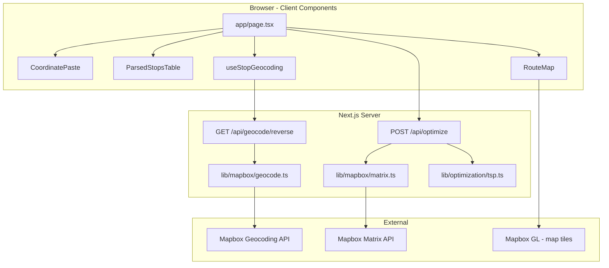
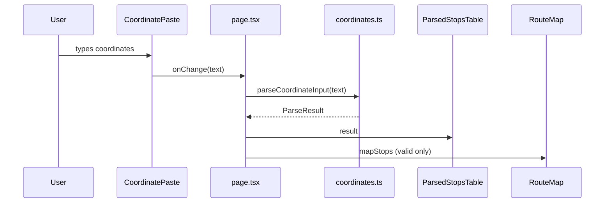
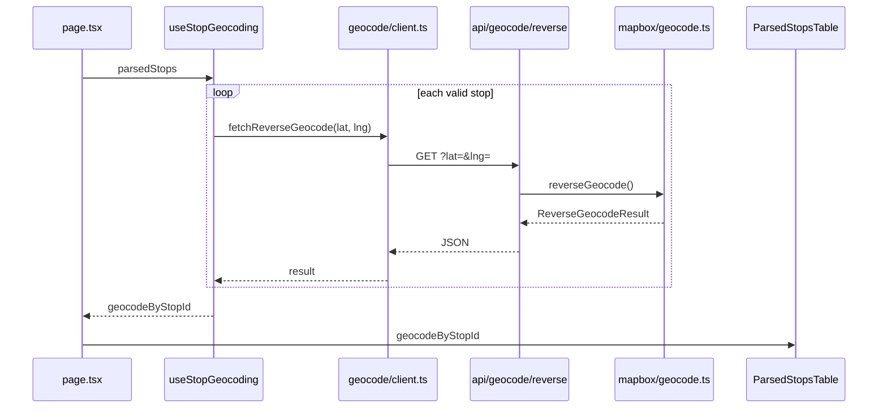
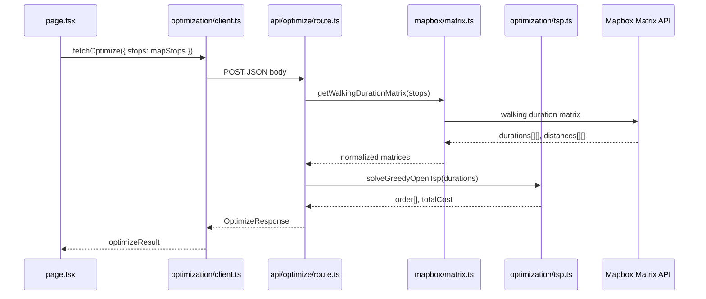
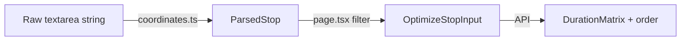

# RouteWise — Architecture & File Map

**Last updated:** reflects codebase through Day A2 (matrix + greedy TSP).  
**Related docs:** [plan.md](./plan.md) (product spec), [schedule.md](./schedule.md) (build order).

This document explains **which files exist, what they do, and how data flows between them**. Use it when you're unsure where logic lives or what calls what.

---

## 1. System overview

RouteWise is a **Next.js 16** app with two parallel pipelines:

| Pipeline | Purpose | Status |
|----------|---------|--------|
| **Input** | Paste coords → validate → show table + map pins | Done (Days 1–2) |
| **Geocode** | Valid coords → street addresses (dev convenience) | Done (Day 2) |
| **Optimize** | Valid coords → walking matrix → TSP visit order | Done through A2 |

**Not wired yet:** `optimizeResult.order` does not reorder map pins or draw a route polyline (Day A3).



---

## 2. Runtime boundaries

Understanding **client vs server** prevents token leaks and explains import rules.

| Layer | Runs where | Can use secret token? | `"use client"` |
|-------|------------|----------------------|----------------|
| `app/page.tsx`, components, hooks | Browser | No | Yes |
| `lib/geocode/client.ts`, `lib/optimization/client.ts` | Browser | No — calls `/api/*` only | No (imported by client) |
| `app/api/**/route.ts` | Node (server) | Yes | No |
| `lib/mapbox/*.ts` | Node only | Yes — `import "server-only"` | No |

**Token split:**

| Env var | Used by | Purpose |
|---------|---------|---------|
| `NEXT_PUBLIC_MAPBOX_TOKEN` | `RouteMap.tsx` | Map tiles + GL markers in browser |
| `MAPBOX_SECRET_TOKEN` | `geocode.ts`, `matrix.ts` | Server-side Geocoding + Matrix API |

---

## 3. Directory map

```
routewise/
├── app/
│   ├── layout.tsx              # Root HTML shell, fonts, metadata
│   ├── page.tsx                # ★ Main orchestrator — all state & wiring
│   ├── globals.css             # Tailwind + mapbox-gl.css
│   └── api/
│       ├── geocode/reverse/route.ts   # Geocode proxy
│       └── optimize/route.ts          # Matrix + TSP endpoint
│
├── components/
│   ├── input/
│   │   ├── CoordinatePaste.tsx        # Textarea (controlled)
│   │   └── ParsedStopsTable.tsx       # Validation results + addresses
│   └── map/
│       └── RouteMap.tsx               # Mapbox GL map + blue pins
│
├── lib/
│   ├── validation/
│   │   └── coordinates.ts             # Parse & validate pasted text
│   ├── geocode/
│   │   ├── types.ts                   # Geocode shapes
│   │   └── client.ts                  # fetch → /api/geocode/reverse
│   ├── optimization/
│   │   ├── types.ts                   # Optimize request/response shapes
│   │   ├── client.ts                  # fetch → /api/optimize
│   │   └── tsp.ts                     # Greedy TSP (pure logic, no I/O)
│   ├── mapbox/
│   │   ├── geocode.ts                 # Mapbox reverse geocode (server)
│   │   └── matrix.ts                  # Mapbox walking matrix (server)
│   └── hooks/
│       └── useStopGeocoding.ts        # Auto-geocode valid stops
│
├── data/
│   ├── sample-stops.ts                # SAMPLE_STOPS_TEXT constant
│   └── sample-stops.csv               # Sample file (reference)
│
└── docs/
    ├── plan.md
    ├── schedule.md
    └── architecture.md                # This file
```

---

## 4. The orchestrator: `app/page.tsx`

Everything user-visible flows through **`page.tsx`**. It holds all React state and connects child components.

### State

| State | Type | Source |
|-------|------|--------|
| `text` | `string` | User types in `CoordinatePaste` |
| `result` | `ParseResult` | `useMemo` → `parseCoordinateInput(text)` |
| `geocodeByStopId` | `Record<string, StopGeocodeState>` | `useStopGeocoding(parsedStops)` |
| `mapStops` | `{ id, lat, lng }[]` | Filtered valid stops from `result` |
| `optimizeResult` | `OptimizeResponse \| null` | Set after Optimize button |
| `optimizeError` | `string \| null` | API errors |

### Derived data (not stored separately)

```
text
  └─► parseCoordinateInput()     → result (ParsedStop[])
        ├─► mapStops             → RouteMap (valid only)
        ├─► parsedStops          → useStopGeocoding
        └─► result               → ParsedStopsTable

mapStops
  └─► fetchOptimize({ stops })   → optimizeResult (on button click)
```

### What page.tsx imports

| Import | Role |
|--------|------|
| `CoordinatePaste` | Textarea UI |
| `ParsedStopsTable` | Table UI |
| `RouteMap` | Map UI |
| `parseCoordinateInput` | Local validation |
| `SAMPLE_STOPS_TEXT` | Demo data button |
| `useStopGeocoding` | Address lookup hook |
| `fetchOptimize` | Calls optimize API |
| `OptimizeResponse` | Type for optimize state |

---

## 5. Pipeline A — Coordinate input & validation

**Trigger:** User pastes or loads sample text.  
**No network calls.**



### Files

| File | Input | Output |
|------|-------|--------|
| [`components/input/CoordinatePaste.tsx`](../components/input/CoordinatePaste.tsx) | `value`, `onChange` props | Renders textarea; no logic |
| [`lib/validation/coordinates.ts`](../lib/validation/coordinates.ts) | Raw string | `ParseResult` with `ParsedStop[]` |
| [`components/input/ParsedStopsTable.tsx`](../components/input/ParsedStopsTable.tsx) | `result`, `geocodeByStopId?` | Renders table rows |

### Key type: `ParsedStop`

```typescript
{
  id: string;           // "row-3"
  lineNumber: number;
  lat: number | null;
  lng: number | null;
  status: "valid" | "invalid" | "duplicate";
  errors: string[];
  duplicateOfLine?: number;
}
```

Defined in `lib/validation/coordinates.ts`. Used by the table, geocode hook, and as the **source** for `mapStops`.

---

## 6. Pipeline B — Reverse geocoding (optional display)

**Trigger:** `result.stops` changes (valid stops extracted).  
**Runs automatically** — no button.



### Files

| File | Calls | Called by |
|------|-------|-----------|
| [`lib/hooks/useStopGeocoding.ts`](../lib/hooks/useStopGeocoding.ts) | `fetchReverseGeocode` | `page.tsx` |
| [`lib/geocode/client.ts`](../lib/geocode/client.ts) | `GET /api/geocode/reverse` | hook |
| [`app/api/geocode/reverse/route.ts`](../app/api/geocode/reverse/route.ts) | `reverseGeocode()` | client fetch |
| [`lib/mapbox/geocode.ts`](../lib/mapbox/geocode.ts) | Mapbox Geocoding API | API route |
| [`lib/geocode/types.ts`](../lib/geocode/types.ts) | — (types only) | hook, client, geocode.ts |

### Key type: `StopGeocodeState`

Keyed by `stop.id` in `geocodeByStopId`. Table looks up `geocodeByStopId[stop.id]` per row.

**Note:** Geocoding is **not** connected to optimization. `OptimizeStopInput` only needs `id`, `lat`, `lng`.

---

## 7. Pipeline C — Route optimization (core)

**Trigger:** User clicks **Optimize**.  
**This is the algorithm path your project lead cares about.**



### Files

| File | Responsibility |
|------|----------------|
| [`lib/optimization/client.ts`](../lib/optimization/client.ts) | Browser → `POST /api/optimize` |
| [`app/api/optimize/route.ts`](../app/api/optimize/route.ts) | Validate body → matrix → TSP → JSON response |
| [`lib/mapbox/matrix.ts`](../lib/mapbox/matrix.ts) | Mapbox Matrix API; null → `Infinity` |
| [`lib/optimization/tsp.ts`](../lib/optimization/tsp.ts) | Greedy nearest-neighbor; pure functions |
| [`lib/optimization/types.ts`](../lib/optimization/types.ts) | `OptimizeRequest`, `OptimizeResponse` |

### Request → response shape

**Request** (`OptimizeRequest`):

```typescript
{
  stops: [{ id: "row-1", lat: 34.25, lng: -118.75 }, ...],
  startIndex?: 0,      // optional, defaults to 0
  roundTrip?: false    // defined but not implemented yet (A4)
}
```

**Response** (`OptimizeResponse`):

```typescript
{
  stops: OptimizeStopInput[],     // same order as input (index = matrix row/col)
  durations: number[][],          // N×N seconds, walking network
  distances: number[][],          // N×N meters
  order: number[],                // visit sequence as stop INDICES
  totalDurationSeconds: number    // sum of leg durations along order
}
```

### How to read `order`

If `stops = [A, B, C, D]` and `order = [0, 3, 1, 2]`:

1. Visit `stops[0]` (A)
2. Walk to `stops[3]` (D)
3. Walk to `stops[1]` (B)
4. Walk to `stops[2]` (C)

Leg cost A→D = `durations[0][3]`.

**Important:** `order` uses **array indices**, not `stop.id` strings.

---

## 8. Pipeline D — Map display

**Trigger:** `mapStops` changes (when paste text changes).  
**Does not use `optimizeResult` yet.**

| File | Input | Behavior |
|------|-------|----------|
| [`components/map/RouteMap.tsx`](../components/map/RouteMap.tsx) | `stops: { id, lat, lng }[]` | Mapbox GL map; blue markers; fit bounds |

- Uses `NEXT_PUBLIC_MAPBOX_TOKEN` in the browser.
- Markers always reflect **paste order** (valid stops only), not optimized visit order.
- No polyline layer yet (A3).

### Gap to close in A3

```typescript
// Today:
<RouteMap stops={mapStops} />

// A3 target:
const orderedStops = optimizeResult
  ? optimizeResult.order.map((i) => mapStops[i])
  : mapStops;
<RouteMap stops={orderedStops} showNumbers routeGeometry={...} />
```

---

## 9. Type boundaries (why so many types?)

The app transforms data through **four representations**. Each layer has its own type so concerns stay separate.



| Type | File | Used when |
|------|------|-----------|
| `ParsedStop` | `validation/coordinates.ts` | Parsing pasted text; table rows; geocode hook |
| `StopGeocodeState` | `geocode/types.ts` | Per-stop address loading/success/error |
| `OptimizeStopInput` | `optimization/types.ts` | API request body; matrix rows |
| `OptimizeResponse` | `optimization/types.ts` | API response; debug panel |

`ParsedStop` has validation metadata (`status`, `errors`). `OptimizeStopInput` is stripped down for the solver. The page **maps** between them in `mapStops`.

---

## 10. API reference (current)

### `GET /api/geocode/reverse`

| | |
|---|---|
| **Query** | `lat`, `lng` |
| **Returns** | `{ primary, candidates[] }` |
| **Errors** | 400 bad coords, 502 Mapbox failure |

### `POST /api/optimize`

| | |
|---|---|
| **Body** | `{ stops: OptimizeStopInput[], startIndex?: number }` |
| **Returns** | `OptimizeResponse` |
| **Errors** | 400 validation, 502 matrix/TSP failure |
| **Limits** | 2–25 stops |

---

## 11. Data flow cheat sheet

**"Where does X come from?"**

| Question | Answer |
|----------|--------|
| Where is paste text stored? | `page.tsx` → `useState(text)` |
| Who parses coordinates? | `lib/validation/coordinates.ts` via `useMemo` in page |
| Who shows addresses? | `useStopGeocoding` → table's Address column |
| Who puts pins on the map? | `mapStops` → `RouteMap` |
| Who calls Mapbox for walking times? | `lib/mapbox/matrix.ts` (server only) |
| Who picks visit order? | `lib/optimization/tsp.ts` via `api/optimize` |
| Where is visit order displayed? | Debug panel in `page.tsx` only (not map yet) |
| Does Optimize use geocoded addresses? | **No** — only `lat`/`lng` |

---

## 12. Component dependency graph

```
app/layout.tsx
  └── app/page.tsx
        ├── components/input/CoordinatePaste.tsx
        ├── components/input/ParsedStopsTable.tsx
        │     ├── lib/validation/coordinates.ts (types)
        │     └── lib/geocode/types.ts (types)
        ├── components/map/RouteMap.tsx
        │     └── mapbox-gl (npm)
        ├── lib/validation/coordinates.ts
        ├── lib/hooks/useStopGeocoding.ts
        │     ├── lib/geocode/client.ts
        │     │     └── lib/geocode/types.ts
        │     └── lib/validation/coordinates.ts (types)
        ├── lib/optimization/client.ts
        │     └── lib/optimization/types.ts
        └── data/sample-stops.ts

app/api/geocode/reverse/route.ts
  └── lib/mapbox/geocode.ts
        ├── lib/geocode/types.ts
        └── server-only

app/api/optimize/route.ts
  ├── lib/mapbox/matrix.ts (server-only)
  ├── lib/optimization/tsp.ts
  └── lib/optimization/types.ts
```

**Rule of thumb:** UI and hooks never import `lib/mapbox/*` directly. They always go through `app/api/*` or `lib/*/client.ts`.

---

## 13. What's built vs what's next

| Feature | Status | Primary files |
|---------|--------|---------------|
| Paste & validate coords | Done | `coordinates.ts`, `CoordinatePaste`, `ParsedStopsTable` |
| Map pins (unordered) | Done | `RouteMap`, `page.tsx` |
| Reverse geocode | Done | geocode pipeline (§6) |
| Walking duration matrix | Done | `matrix.ts`, `api/optimize` |
| Greedy TSP visit order | Done | `tsp.ts`, `api/optimize` |
| Numbered pins in visit order | **Not started** | A3 → `RouteMap` + `page.tsx` |
| Street-following polyline | **Not started** | A3 → new `lib/mapbox/directions.ts` |
| Round-trip toggle | **Not started** | A4 |
| Penalty weights | **Not started** | Week 2 → extend `tsp.ts` or Python service |
| Org enriched stop import | **Not started** | Week 3 |

---

## 14. Environment & running locally

```env
# .env.local
NEXT_PUBLIC_MAPBOX_TOKEN=pk....
MAPBOX_SECRET_TOKEN=sk....
```

```bash
npm run dev     # http://localhost:3000
npm run build   # production check
```

---

## 15. Mental model

Think of the app as **three independent pipes** that meet in `page.tsx`:

1. **Parse pipe** — text → validated stops (sync, local)
2. **Geocode pipe** — valid stops → addresses (async, optional display)
3. **Optimize pipe** — valid stops → visit order (async, on button click)

Only pipe 1 feeds the map today. Pipe 3 produces `order` but the map doesn't consume it yet — that's the main wiring gap before the route becomes visible.
