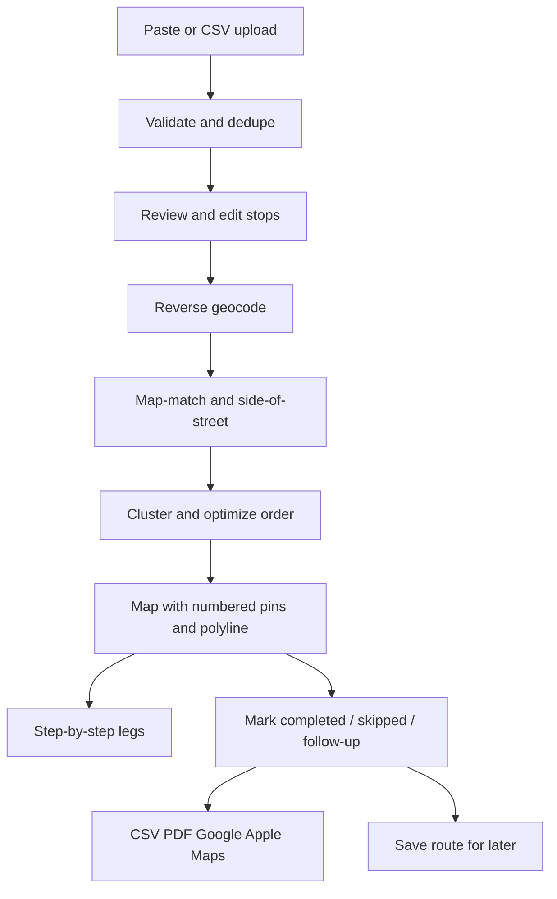
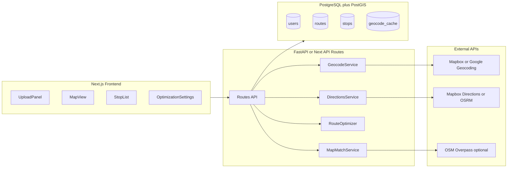

# Sales Rep Door-to-Door Route Planner — Updated Plan

Revise [README.md](README.md) to replace the generic "Smart Routing" framing with a **sales-rep-focused web application** for optimized door-to-door walking routes. The document should read as a complete architecture + product spec, not just a backend sketch.

---

## Document structure (new README outline)

Replace the current 200-line README with these sections:

### 1. Product vision
- **Audience:** field sales reps visiting residential/commercial addresses on foot
- **Job-to-be-done:** paste or upload leads → see addresses on a map → get a natural, efficient walking order that avoids zig-zagging and unnecessary street crossings
- **Non-goal:** pure straight-line or naive TSP; the optimizer must penalize poor sales-walking behavior

### 2. Core user flows



### 3. Feature requirements (map 1:1 to user spec)

| Area | Key points to document |
|------|------------------------|
| **Input** | Manual paste; CSV with `latitude, longitude, name, notes, priority, address_type`; validation + duplicate flagging; pre-route edit/remove |
| **Geocoding** | Full street address; store coords + resolved address; ambiguous coords → show candidate matches |
| **Map UI** | Numbered pins in visit order; click for details; polyline; set start/end; round-trip vs open route |
| **Routing** | Real walk network; side-of-street preference; cluster nearby stops; penalize crossings, U-turns, backtracking, rear/side entrances |
| **Output** | Per-stop stats + warnings; totals including crossing count; exportable summary |
| **Navigation** | Pedestrian-safe step-by-step directions between stops |
| **User controls** | Manual reorder, lock stops, exclude, visit statuses, notes, exports, saved routes |

### 4. Architecture



**Recommended concrete stack** (pick one path in README, note alternatives):
- **Frontend:** Next.js 14+ (App Router), React, Mapbox GL JS
- **Backend:** Python FastAPI (OR-Tools + geospatial libs) *or* Next.js API routes for MVP-only
- **Database:** PostgreSQL 16 + PostGIS
- **Geocoding:** Mapbox Geocoding API (primary); Nominatim for dev/low-cost fallback
- **Routing/matrix:** Mapbox Matrix + Directions (walking profile)
- **Optimization:** OR-Tools TSP with **custom penalty-augmented cost matrix**
- **Side-of-street / entrances (advanced):** OSM Overpass + PostGIS for sidewalk/way geometry

Rationale: single vendor (Mapbox) for map + geocode + matrix + directions keeps MVP simple; PostGIS handles clustering and spatial joins; OR-Tools handles constrained ordering at scale.

### 5. Routing algorithm (centerpiece — replace naive TSP section)

Document a **three-stage pipeline** with explicit pseudocode in README:

**Stage A — Enrichment**
1. Reverse-geocode each stop; persist formatted address + components
2. Map-match coordinate to nearest OSM `highway=*` way (within ~30 m)
3. Infer `side_of_street` (left/right/north/south/east/west) from house number parity + way direction, or geometric projection when parity unavailable
4. Snap pedestrian access point to nearest public sidewalk node (not alley/service road unless primary entrance)
5. Flag warnings: `entrance_uncertain`, `requires_crossing`, `gated_complex`, `cul_de_sac`

**Stage B — Clustering**
1. Cluster stops by walking proximity (~150 m) and shared street segment using PostGIS `ST_ClusterDBSCAN` / `ST_DWithin`
2. Within each street segment cluster, order stops serpentine (monotonic along way direction) to minimize backtracking
3. Treat cul-de-sacs, plazas, and apartment complexes as sub-clusters with internal ordering before inter-cluster TSP

**Stage C — Global optimization with penalties**
1. Build base N×N matrix from Mapbox walking **duration** (not haversine)
2. Augment edge cost `(i → j)`:

```
cost(i,j) = duration(i,j)
  + w_cross  * crossing_penalty(i,j)
  + w_side   * side_switch_penalty(i,j)
  + w_uturn  * u_turn_penalty(i,j)
  + w_back   * backtrack_penalty(i,j)
  + w_rear   * rear_approach_penalty(j)
```

3. Solve open/closed TSP with OR-Tools respecting locked stops and fixed start/end
4. Post-process: fetch walking directions per leg; count crossings from turn-by-turn steps; refine warnings

**Pseudocode block** to include in README (~40 lines): `enrich_stops`, `cluster_stops`, `build_penalty_matrix`, `solve_tsp`, `build_legs`.

**User-adjustable weights** (`w_cross`, `w_side`, `w_uturn`, `w_back`, `w_rear`, `w_distance`) stored on `routes.optimization_settings` JSONB; exposed in UI sliders with sensible defaults.

**Honest MVP vs advanced split:**
- **MVP:** duration matrix + side-switch penalty (when side known) + clustering; crossing count from directions API post-hoc
- **Advanced:** OSM sidewalk graph, explicit crossing detection, entrance classification, serpentine within-block ordering

### 6. Database schema (new section)

Document tables with key columns and PostGIS types:

```sql
-- users
id, email, name, created_at

-- routes
id, user_id, name, status, round_trip, start_stop_id, end_stop_id,
optimization_settings JSONB, total_distance_m, total_duration_s,
crossing_count, created_at, updated_at

-- stops
id, route_id, sequence_order, input_lat, input_lng,
snapped_lat, snapped_lng, formatted_address, address_components JSONB,
street_name, house_number, side_of_street, address_type, priority,
name, notes, visit_status, geocode_confidence, warnings TEXT[],
locked BOOLEAN, excluded BOOLEAN

-- route_legs
id, route_id, from_stop_id, to_stop_id, sequence,
distance_m, duration_s, crossing_count, geometry GEOGRAPHY(LINESTRING),
steps JSONB

-- geocode_cache
geohash, lat, lng, response JSONB, provider, created_at

-- saved_exports (optional)
id, route_id, format, url, created_at
```

Include indexes: `stops(route_id)`, `stops(visit_status)`, GIST on snapped coordinates, `geocode_cache(geohash)`.

### 7. API endpoints (expand beyond current job sketch)

| Method | Path | Purpose |
|--------|------|---------|
| POST | `/api/routes` | Create route from paste or CSV payload |
| GET | `/api/routes/:id` | Full route with stops, legs, totals |
| PATCH | `/api/routes/:id` | Update name, start/end, optimization weights |
| POST | `/api/routes/:id/stops` | Add stop |
| PATCH | `/api/routes/:id/stops/:stopId` | Edit, lock, exclude, status, notes |
| DELETE | `/api/routes/:id/stops/:stopId` | Remove stop |
| POST | `/api/routes/:id/optimize` | Re-run optimizer (respects locks/exclusions) |
| POST | `/api/routes/:id/reorder` | Manual order override |
| GET | `/api/routes/:id/directions` | Step-by-step legs |
| GET | `/api/routes/:id/export?format=csv\|pdf\|gmaps\|apple` | Export |
| GET | `/api/users/me/routes` | Saved routes list |

Geocoding ambiguity: `GET /api/geocode/reverse?lat=&lng=` returns `{ primary, candidates[] }`.

### 8. Frontend component structure (new section)

```
app/
  page.tsx                    # Dashboard / new route
  routes/[id]/page.tsx        # Main route workspace
components/
  input/
    CoordinatePaste.tsx
    CsvUpload.tsx
    StopReviewTable.tsx       # edit/remove before optimize
  map/
    RouteMap.tsx              # Mapbox GL, pins, polyline, click handler
    StopPopup.tsx
    StartEndPicker.tsx
  route/
    OrderedStopList.tsx       # drag reorder, lock, status badges
    LegSummary.tsx
    OptimizationSettings.tsx  # weight sliders
    TurnByTurnPanel.tsx
  export/
    ExportMenu.tsx
```

### 9. Route output spec (per stop + totals)

Document exact fields returned to UI and exports:

**Per stop:** stop_number, address, lat/lng, leg_distance_m, leg_duration_s, side_of_street, warnings[], visit_status, notes, priority, address_type

**Totals:** total_distance_m, total_duration_s, crossing_count, suggested_start, suggested_end

### 10. Third-party API recommendations (table)

| Capability | MVP pick | Alternatives |
|------------|----------|--------------|
| Map + geocode + matrix + directions | Mapbox | Google Maps Platform |
| Self-hosted routing | OSRM (walking) | Valhalla, GraphHopper |
| Side-of-street / sidewalks | OSM Overpass + PostGIS | HERE, proprietary |
| Optimization | OR-Tools | Custom 2-opt/3-opt, GraphHopper VRP |

### 11. Implementation phases (revised)

| Phase | Scope | Duration hint |
|-------|-------|---------------|
| **MVP** | Paste + CSV upload, validation, Mapbox geocode, duration-matrix TSP with side-switch penalty, map with numbered pins + polyline, start/end + round-trip, CSV export, single-user (no auth) | 3–4 weeks |
| **V1** | PostgreSQL + PostGIS, user accounts, saved routes, visit statuses, manual reorder/lock/exclude, Google/Apple Maps export, crossing count | +3 weeks |
| **Advanced** | OSM map-matching, serpentine block ordering, entrance classification, PDF export, adjustable penalty weights, ambiguous geocode picker | +4–6 weeks |

### 12. Example code snippets (appendix in README)

Include concise, illustrative examples (not full app):
- CSV parse + validate coordinates
- Mapbox reverse geocode call
- PostGIS cluster query
- Penalty-augmented matrix builder (Python)
- OR-Tools TSP with fixed start/end
- Mapbox GL: add numbered markers + route layer

### 13. Edge cases (expand current list)

Add sales-specific cases:
- Same building, multiple units → cluster, internal order by unit number
- Corner lots → side inference may be ambiguous → show warning
- Commercial plazas / strip malls → treat as single cluster, walk perimeter
- Gated communities → flag if geocode centroid != pedestrian gate
- Duplicate leads at same address → dedupe with user override

### 14. Success criteria (revised)

- Routes use **walking network duration**, never haversine-only ordering
- For typical suburban blocks (15–25 stops), crossing count **≤ manual serpentine baseline**
- Side-of-street consistency: **≥ 80%** consecutive same-side visits when data available (advanced)
- 20-stop optimize + render **< 15 s** (warm cache)
- Rep can complete a full visit session: upload → optimize → mark stops → export without leaving the app

### 15. Deliverables checklist (explicit)

The README closing section should list what the repo will eventually contain:
- Architecture plan (this document)
- Database schema + migrations
- API spec
- Frontend component tree
- Routing algorithm pseudocode
- MVP vs advanced scope
- Example integration code

---

## What changes vs current README

| Current | Updated |
|---------|---------|
| Generic "Smart Routing" | Sales-rep door-to-door product |
| CLI mentioned equally with web | Web-first (Next.js) |
| Simple TSP on time matrix | Penalty-augmented TSP + clustering + side-of-street |
| SQLite option | PostgreSQL + PostGIS as primary |
| Minimal API (jobs only) | Full CRUD routes/stops + optimize/reorder/export |
| No data model | Full schema with visit statuses |
| No UI structure | Component tree documented |
| No visit management | Completed/skipped/follow-up flows |
| Phase 4 = basic UI | Phased MVP → V1 → Advanced with honest scope |

---

## File to edit

Single file update: [README.md](README.md) — full rewrite preserving markdown quality, mermaid diagrams, and tables; target ~400–500 lines to cover all deliverables without being bloated.

No application code in this step — documentation only.

---

## 2–3 week implementation schedule (build order)

Principle: **vertical slices** — each day should produce something visible or testable. Defer Postgres, auth, OSM map-matching, and penalty weights until after the core loop works (paste → geocode → optimize → map).

### Week 1 — Input, geocoding, map (no optimizer yet)

| Day | Focus | Done when |
|-----|-------|-----------|
| **Day 1 (today)** | Scaffold + input + raw map | See checklist below |
| Day 2 | Reverse geocoding API route + address list UI | Paste 10 coords → see formatted addresses |
| Day 3 | CSV upload + validation + duplicate flagging | Upload sample CSV; invalid rows highlighted |
| Day 4 | Stop review table (edit/remove before route) | User can fix bad rows before continuing |
| Day 5 | Map polish: click pin → popup with address details | All geocoded stops on map with popups |

### Week 2 — Optimizer + route visualization

| Day | Focus | Done when |
|-----|-------|-----------|
| Day 6 | FastAPI service (or Next API) + Mapbox Matrix (walking duration) | N×N duration matrix for ≤25 stops |
| Day 7 | OR-Tools TSP: open route, fixed start, round-trip | API returns visit order indices |
| Day 8 | Mapbox Directions per leg → merged polyline + totals | Numbered pins in order + route line on map |
| Day 9 | Start/end picker + round-trip toggle; re-optimize | User sets depot; order updates |
| Day 10 | Ordered stop list sidebar (distance/time per leg) | Full route summary visible |

### Week 3 — Rep workflow + ship MVP

| Day | Focus | Done when |
|-----|-------|-----------|
| Day 11 | CSV export (order, address, lat, lng, leg stats) | Download works |
| Day 12 | Manual reorder (drag) + lock first/last stop | Locked stops respected on re-optimize |
| Day 13 | Exclude stops + visit status badges (completed/skipped/follow-up) | Status persists in session |
| Day 14 | In-memory or SQLite route save/load (skip auth) | Named routes reload after refresh |
| Day 15 | Error states, loading UX, sample data, README run instructions | Demo-ready MVP |

**Defer past MVP (week 4+):** PostgreSQL/PostGIS, user accounts, side-of-street penalties, OSM enrichment, PDF export, Google/Apple deep links, crossing-count analytics, adjustable weight sliders.

### Day 1 checklist (today only)

1. **Accounts & keys** (~30 min)
   - Create Mapbox account; note public token + secret token
   - Add `.env.local` with `NEXT_PUBLIC_MAPBOX_TOKEN` and `MAPBOX_SECRET_TOKEN`

2. **Repo scaffold** (~1 hr)
   - `npx create-next-app@latest` (App Router, TypeScript, Tailwind)
   - Folder layout: `components/input/`, `components/map/`, `lib/validation/`
   - Add `mapbox-gl` dependency

3. **Coordinate input** (~2 hr)
   - `CoordinatePaste.tsx`: textarea accepting `lat,lng` per line (and tab-separated)
   - `lib/validation/coordinates.ts`: bounds check, parse errors, flag duplicates within ~10 m
   - Local state only (no API yet); show parsed list in a simple table

4. **Map with unordered pins** (~2 hr)
   - `RouteMap.tsx`: Mapbox GL map centered on first point (or default city)
   - Render one marker per valid coordinate
   - Fit bounds to all pins

5. **Sample data** (~15 min)
   - `data/sample-stops.csv` with 15–20 real suburban addresses for your target market

**End-of-day success:** Open localhost → paste 10 coordinates → see pins on map; invalid/duplicate rows flagged in table. No geocoding or routing required today.

**Do not start today:** FastAPI, OR-Tools, Postgres, TSP, CSV upload, optimization — those are Days 2–7.
