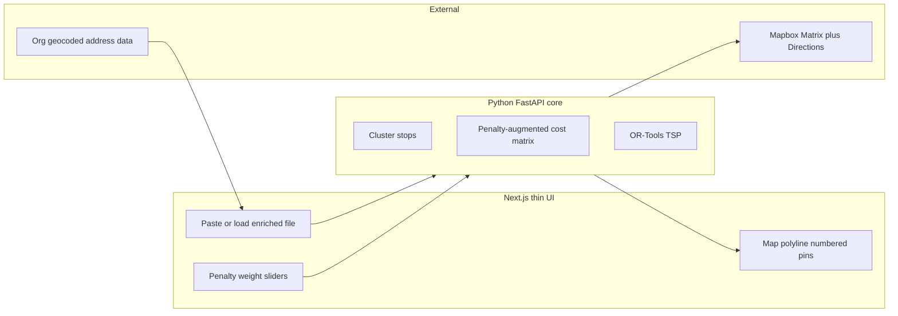

# Routewise Implementation Schedule

**Pace:** 4 hours/day  
**MVP target:** ~3 weeks (15 working days)  
**Principle:** Vertical slices — each day produces something visible or testable.

See [plan.md](./plan.md) for full product spec, architecture, and algorithm details.

---

## Strategic focus (updated)

**Pivot:** Routing algorithm is the core deliverable. Another organization handles bulk coordinate → address conversion at scale. This app should produce the **best possible walking visit order** under real-world constraints.

**Primary constraints:**

- Follow the walking road network (no haversine-only or awkward straight-line paths)
- Minimize unnecessary street crossings
- End near the start (round-trip / return-to-depot)
- Avoid zig-zags, U-turns, and backtracking
- Prefer same side of street when enrichment data is available

**What the UI is for:** A thin dev/demo harness — paste or load coords, optimize, visualize the route, tune penalty weights. Not a full rep workflow app (yet).

---

## Progress summary (as of Jun 23, 2026)

### Completed — Dev harness (original Days 1–2)

| Area | Files | Status |
|------|-------|--------|
| Validation | `lib/validation/coordinates.ts` | Done |
| Paste UI | `components/input/CoordinatePaste.tsx` | Done |
| Results table | `components/input/ParsedStopsTable.tsx` | Done |
| Map | `components/map/RouteMap.tsx` | Done |
| Sample data | `data/sample-stops.ts`, `data/sample-stops.csv` | Done |
| Reverse geocode (dev only) | `lib/mapbox/geocode.ts`, `app/api/geocode/reverse/`, `lib/hooks/useStopGeocoding.ts` | Done |
| Homepage | `app/page.tsx` | Done |

**What works today:**

- Paste or load sample coordinates → validate, dedupe, show on map
- Reverse geocode addresses in the table (useful for local dev; not the product differentiator)
- Blue pins on Mapbox map, fit bounds

**This harness is kept** for algorithm development and demos. Do not invest further in geocoding UX or bulk ingest.

---

## What changed vs original schedule

| Original plan | New plan |
|---------------|----------|
| Week 1 = input, geocoding, CSV | **Skip** — org handles bulk address conversion |
| Week 2 = first optimizer work | **Week 1** = baseline routing (matrix, TSP, polyline) |
| Week 3 = rep workflow (export, visit status) | **Week 2** = penalty algorithm (the differentiator) |
| Penalty weights deferred to Week 4+ | **Week 2** = penalty weights + tuning UI |
| Geocoding as milestone | **Optimize → visualize** as milestone |

### Deferred (do not build until algorithm MVP ships)

- CSV upload (`CsvUpload.tsx`)
- Stop review / edit table
- Map popups with address details
- Visit status badges (completed / skipped / follow-up)
- Route save/load, auth, PostgreSQL
- CSV/PDF export, Google/Apple Maps deep links
- Further reverse-geocoding investment (caching, ambiguity picker)

### Kept as-is (no more work unless needed for algo testing)

- Coordinate paste + validation
- Map with pins
- Reverse geocode (dev convenience only)
- Sample stops for benchmarks

---

## Architecture



- **Next.js:** UI, Mapbox map rendering, API proxies for Matrix/Directions (initially)
- **Python FastAPI:** OR-Tools TSP, clustering, penalty matrix (promote here as algorithm grows)
- **Mapbox:** Walking duration matrix + Directions polylines (never haversine-only ordering)

---

## Org import contract (define early)

Coordinate with the other organization on an enriched stop format. Algorithm penalties depend on which fields they provide.

**Minimum (required):**

```json
{
  "stops": [
    { "id": "1", "lat": 34.252084, "lng": -118.750213 }
  ]
}
```

**Ideal (enables full penalty matrix):**

```json
{
  "stops": [
    {
      "id": "1",
      "lat": 34.252084,
      "lng": -118.750213,
      "street_name": "Coppertree Court",
      "house_number": "731",
      "side_of_street": "north",
      "address_type": "residential"
    }
  ]
}
```

| Field | Used for |
|-------|----------|
| `lat`, `lng` | Matrix, map pins, clustering |
| `side_of_street` | Side-switch penalty (`w_side`) |
| `street_name` | Block clustering, serpentine ordering |
| `house_number` | Within-block sort order |

---

## Phase 1 — Baseline routing (Week 1)

**Milestone:** Paste 15 coords → click Optimize → sensible walking order on map with numbered pins and street-following polyline.

| Day | Focus | Done when |
|-----|-------|-----------|
| **A1** | Mapbox Matrix API + optimize API skeleton | `lib/mapbox/matrix.ts`; `POST /api/optimize` returns N×N walking durations for ≤25 stops |
| **A2** | Naive TSP solver | OR-Tools (FastAPI) or greedy nearest-neighbor; API returns visit order indices |
| **A3** | Directions + polyline | Mapbox Directions per leg; merged route line on map; numbered pins in visit order |
| **A4** | Round-trip + fixed start/end | Toggle open route vs return near start; re-optimize on change |
| **A5** | Ordered stop list + leg stats | `OrderedStopList.tsx` + totals; crossing count from directions (post-hoc) |

**A1 is the immediate next step** — skip original Days 3–5 (CSV, review table, map popups).

---

## Phase 2 — Penalty algorithm (Week 2)

**Milestone:** Penalty-augmented TSP measurably beats naive TSP on crossing count and route naturalness. Weights tunable in UI.

Maps to [plan.md](./plan.md) Stages B + C:

```
cost(i,j) = duration(i,j)
  + w_cross * crossing_penalty(i,j)
  + w_side  * side_switch_penalty(i,j)
  + w_uturn * u_turn_penalty(i,j)
  + w_back  * backtrack_penalty(i,j)
```

| Day | Focus | Done when |
|-----|-------|-----------|
| **B1** | Street-proximity clustering | Stops on same block grouped before global TSP |
| **B2** | Side-switch penalty | Consecutive same-side visits when `side_of_street` known |
| **B3** | Crossing penalty | Penalize edges that imply a street crossing |
| **B4** | U-turn + backtrack penalties | Serpentine-ish ordering within clusters |
| **B5** | `OptimizationSettings` sliders | `w_cross`, `w_side`, `w_uturn`, `w_back`, round-trip weight; re-optimize on change |

---

## Phase 3 — Integration + credibility (Week 3)

**Milestone:** Demo-ready for project lead — benchmark results, org data import, constraint tuning documented.

| Day | Focus | Done when |
|-----|-------|-----------|
| **C1** | Load enriched stops from org file | JSON/CSV import uses org-provided fields (not geocode API) |
| **C2** | Benchmark suite | 3–5 fixed suburban datasets; log crossings, duration, side consistency |
| **C3** | Lock / exclude stops in optimizer | Constraints respected on re-optimize |
| **C4** | Before/after comparison UI | Naive TSP vs penalty TSP side-by-side or toggle |
| **C5** | Demo doc + README | How to run optimizer, tune weights, interpret metrics |

**MVP ship target:** end of Week 3

---

## Success criteria (revised)

| Criterion | Target |
|-----------|--------|
| Network-based routing | Visit order uses Mapbox walking **duration**, never haversine-only |
| Crossing count | ≤ manual serpentine baseline on 15–25 stop suburban sets |
| Round-trip | End stop within ~200 m of start when round-trip enabled |
| Side consistency | ≥ 80% consecutive same-side visits when org provides `side_of_street` |
| Performance | 20-stop optimize + render < 15 s (warm cache) |
| Visual proof | Numbered pins + polyline follows streets (Directions geometry) |

---

## Deferred past algorithm MVP (Week 4+)

Only after Phase 3 milestone:

- PostgreSQL + PostGIS
- User accounts / saved routes
- OSM map-matching, sidewalk graph, entrance classification
- Full rep workflow (visit status, exports, save/load)
- PDF export, Google/Apple Maps deep links
- Further geocoding features (cache, ambiguity picker)

---

## Pace notes

- At **4 hrs/day**, each day above ≈ one calendar day (weekends off).
- **Highest-risk days:** A2 (OR-Tools / FastAPI setup), B1–B3 (penalty design). Budget extra half-days if needed.
- **Do not stack** input/geocoding work — if behind, defer UI polish, not algorithm core.
- Use the existing Simi Valley sample set as the primary benchmark dataset throughout.

---

## Quick reference: restriction → implementation

| Project lead constraint | Implementation |
|-------------------------|----------------|
| Don't unnecessarily cross the street | `w_cross * crossing_penalty(i,j)` |
| End near start | Round-trip TSP or return-to-depot cost term |
| Follow the road | Mapbox walking matrix + Directions polylines |
| No awkward zig-zags | `w_uturn`, `w_back` + block clustering |
| Same side of street | `w_side * side_switch_penalty` (needs org data) |
